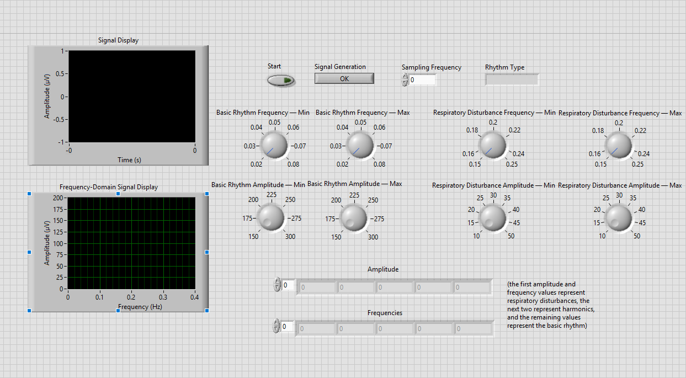
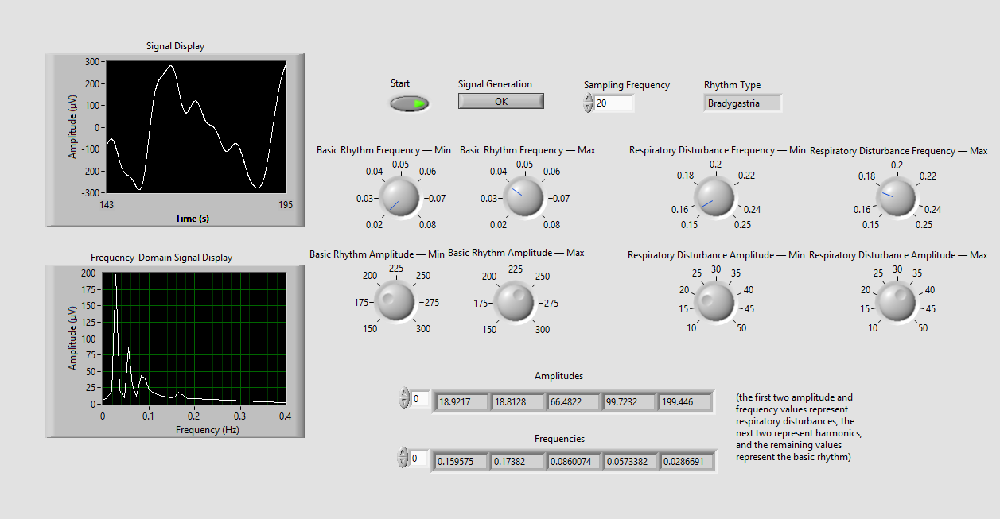
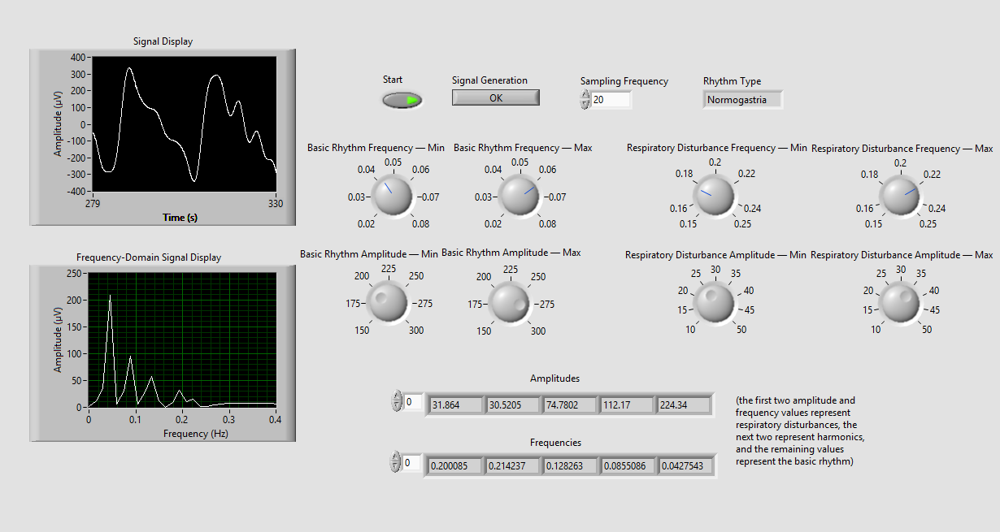
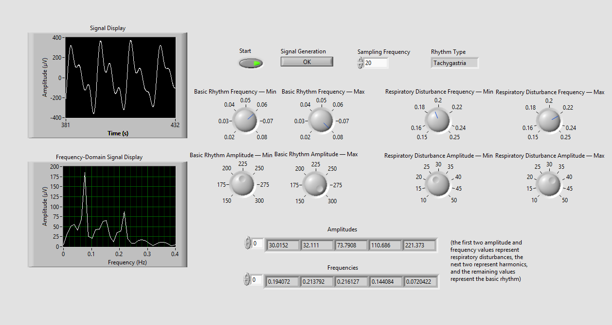
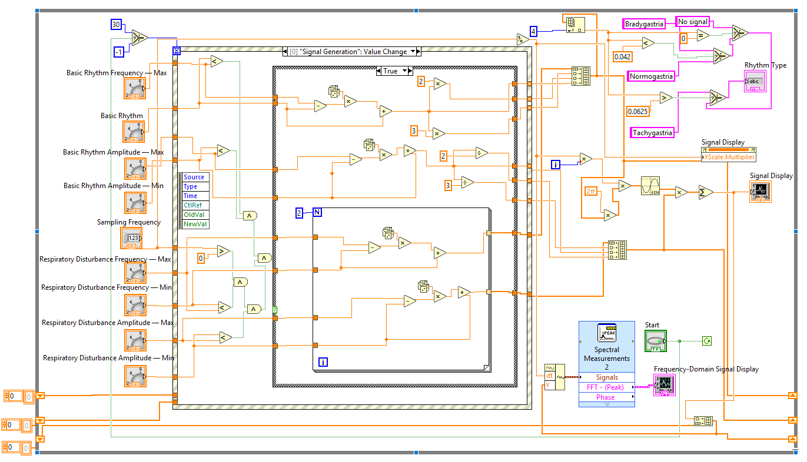
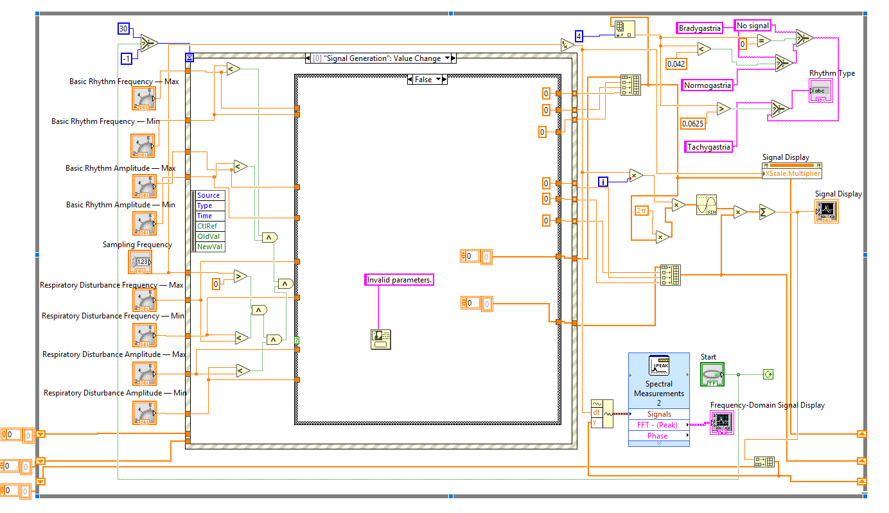
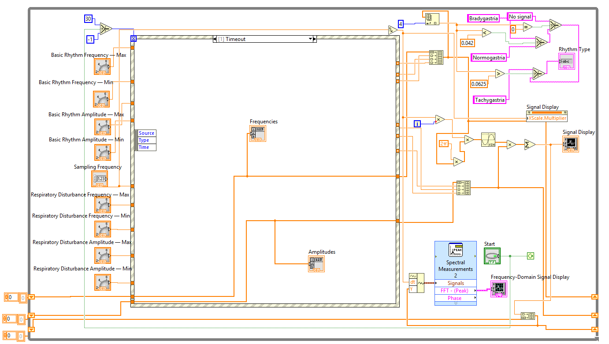

# EGG Signal Simulation (LabVIEW)

LabVIEW simulation of an electrogastrogram (EGG) signal with input validation, rhythm classification and spectral analysis

## Overview

The signal is the sum of a basic gastric rhythm with two harmonics and two respiratory disturbance components. The basic rhythm and the respiratory disturbance components are generated randomly within the ranges set on the front panel, and the harmonics are derived from the basic rhythm. Frequencies are in Hz and amplitudes are in µV.

## Features

- Adjustable ranges for the basic rhythm frequency and amplitude
- Adjustable ranges for the respiratory disturbance frequency and amplitude
- Adjustable sampling frequency
- Input validation: an error message is shown if a minimum value is greater than its maximum
- Time-domain display of the generated signal
- Frequency-domain display (FFT)
- Automatic rhythm classification

## Requirements

- LabVIEW 2026 or newer
- For older versions, use [`egg-signal-simulation-2020.vi`](egg-signal-simulation-2020.vi), saved for LabVIEW 2020
  
## How to run

1. Download [`egg-signal-simulation.vi`](egg-signal-simulation.vi) and open it in LabVIEW.
2. Set the minimum and maximum values for the basic rhythm and respiratory disturbance.
3. Set the sampling frequency.
4. Press **Start** to run the simulation.
5. Press **Signal Generation** to generate new parameters.

## Front panel

Front panel with the main controls: signal generation, sampling frequency, ranges for the basic rhythm and the respiratory disturbance, the time-domain and frequency-domain graphs, and the detected rhythm type.

### Bradygastria

Basic rhythm of 0.024 Hz, below 0.042 Hz, so the rhythm is classified as bradygastria. The spectrum has its main peak at the basic rhythm frequency, followed by its harmonics.

### Normogastria 

Basic rhythm of 0.043 Hz, between 0.042 and 0.0625 Hz, so the rhythm is classified as normogastria.

### Tachygastria 

Basic rhythm of 0.072 Hz, above 0.0625 Hz, so the rhythm is classified as tachygastria.

## Block diagram

### Valid input (True case)

When the input is valid, the program generates the basic rhythm frequency and amplitude as random values within the ranges set on the front panel. The harmonics are derived from them: their frequencies are 2x and 3x the basic rhythm frequency, and their amplitudes are the basic rhythm amplitude divided by 2 and by 3. A loop that runs twice generates the frequency and amplitude of two respiratory disturbance components, again randomly within the set ranges. The signal is the sum of sine waves, one for each frequency and amplitude pair, and it is shown in the time domain. An FFT of the same signal is shown in the frequency-domain display.

### Invalid input (False case)

If any minimum value is greater than its maximum, the program shows an error message and does not generate a signal.

### Timeout case

## Rhythm classification

| Basic rhythm frequency | Type |
|---|---|
| below 0.042 Hz (2.5 cycles/min) | Bradygastria |
| 0.042 to 0.0625 Hz | Normogastria |
| above 0.0625 Hz (3.75 cycles/min) | Tachygastria |

## Background

The electrogastrogram (EGG) is a recording of the electrical activity of the stomach. In healthy people the dominant rhythm is about 3 cycles per minute. A slower rhythm is called bradygastria and a faster one tachygastria.

## Author

Ivan Šmidt

Faculty of Technical Sciences, University of Novi Sad

Biomedical Engineering, course: Clinical Engineering, 2026
